<div align="center">
  <a href="https://github.com/aeb56">
    
  </a>
</div>

<div align="center">
  <a href="https://www.linkedin.com/in/abelbancu/"></a>
  <a href="https://optivise.ai"></a>
  
  
</div>

<br />

<div align="center">
  <a href="https://git.io/typing-svg">
    
  </a>
</div>

---

## whoami

```txt
> AI engineer / researcher. CTO at Optivise. MSc AI — Distinction, City (London).
> Incoming PhD at Kent on behaviour-first robot navigation: policies that don't
> just reach the goal, they move like you'd want a robot to.
>
> I like agents. I like the ones that learn, and I like the ones that ship.
```

My reward function this past year had two massive goals: **survive my thesis** and **build a startup**. The model converged. Conclusion? I apparently enjoy the chaos.

---

## currently

- 🛰 **CTO @ [Optivise](https://optivise.ai)** — trustworthy, low-hallucination AI for teams who can't afford to be wrong.
- 🧪 **Research** — behaviour-first deep RL for robot navigation. PPO on Stable-Baselines3, Hyperion GPU cluster. Reward shaping that cares about *how* a policy moves, not just whether it reaches the goal.
- 🎓 **PhD-bound at Kent** — picking up where the MSc left off: the agent solved the problem we specified, not the one we cared about. That gap is the thesis.
- 🧩 **Paper** — contributor on [**PALMS**](https://arxiv.org/abs/2602.07519), a Rescorla-Wagner-style associative learning model.

---

## featured work

<table>
  <tr>
    <td width="50%" valign="top">
      <h3>🚁 Drone Navigation via Deep RL</h3>
      <p><em>INM363 MSc Thesis — Distinction</em></p>
      <p>PPO agent learning 3D collision-free navigation in procedurally generated environments. Reward shaping explored the gap between <em>reaching</em> the goal and <em>moving like you'd want a drone to</em>. Ran on Hyperion GPU cluster.</p>
      <sub>C# · Unity ML-Agents · PPO · Stable-Baselines3</sub>
      <br /><br />
      <a href="https://github.com/aeb56/DRONENAVIGATIONRL"></a>
    </td>
    <td width="50%" valign="top">
      <h3>🧠 PALMS</h3>
      <p><em>Associative learning model · published team</em></p>
      <p>Python implementation of a Rescorla-Wagner-style learning model. My contribution: simulation logic + experimental pipeline. Paper lives on arXiv.</p>
      <sub>Python · NumPy · SciPy · Matplotlib</sub>
      <br /><br />
      <a href="https://github.com/aeb56/PALMS"></a>
      <a href="https://arxiv.org/abs/2602.07519"></a>
    </td>
  </tr>
  <tr>
    <td width="50%" valign="top">
      <h3>🏥 Clinical Prediction Models</h3>
      <p><em>Brain tumour classification · heart-attack risk</em></p>
      <p>Two applied-ML projects: MRI-based tumour classification with transfer learning, and tabular risk scoring on clinical features. Focus on calibration and honest-about-uncertainty outputs.</p>
      <sub>PyTorch · scikit-learn · Grad-CAM</sub>
    </td>
    <td width="50%" valign="top">
      <h3>🗣 Word-Prediction Language Model</h3>
      <p><em>Small-scale next-token model, from scratch</em></p>
      <p>Byte-pair tokenisation, transformer block, trained on a curated corpus. Built to understand the stack end-to-end, not to beat SOTA.</p>
      <sub>PyTorch · Transformers · BPE</sub>
    </td>
  </tr>
  <tr>
    <td width="50%" valign="top">
      <h3>🌊 Underwater Depth Estimation</h3>
      <p><em>Monocular depth in hostile lighting</em></p>
      <p>CV project on depth estimation where the usual priors (sky, linear perspective) break. Encoder-decoder with attention, custom loss for turbidity.</p>
      <sub>PyTorch · Depth · Attention</sub>
    </td>
    <td width="50%" valign="top">
      <h3>🚛 Dispatch Optimisation</h3>
      <p><em>Fleet routing under real-world constraints</em></p>
      <p>OR + learning hybrid: constraint solver for hard rules, bandit for soft preferences learned from operator overrides.</p>
      <sub>Python · OR-Tools · Bandits</sub>
    </td>
  </tr>
</table>

> Most of my current work is in private repos at Optivise. The public side here is thesis + coursework + paper code — enough to show the taste, not the whole kitchen.

---

## stack

<div align="center">

**agents & research**


**production & llm apps**


**infra & research ops**


</div>

---

## the numbers

<div align="center">

<a href="https://github.com/aeb56">
  
</a>
<a href="https://github.com/aeb56">
  
</a>

<br />

<a href="https://github.com/aeb56">
  
</a>

</div>

---

## contribution graph

<div align="center">
  <picture>
    <source media="(prefers-color-scheme: dark)" srcset="https://raw.githubusercontent.com/aeb56/aeb56/output/github-snake-dark.svg" />
    <source media="(prefers-color-scheme: light)" srcset="https://raw.githubusercontent.com/aeb56/aeb56/output/github-snake.svg" />
    
  </picture>
</div>

---

## what I care about

- **Behaviour over benchmarks.** A policy that reaches the goal with a reward graph that looks great but moves like a drunk pigeon is not a solved problem.
- **Honest AI.** At Optivise I spend most of my time thinking about when a model should say *I don't know* instead of hallucinating. Cheaper to build trust once than to apologise forever.
- **Research that ships.** The point of a paper is that someone can use it. Same for a thesis, same for a product.

---

## where to find me

<div align="center">

<a href="https://www.linkedin.com/in/abelbancu/"></a>
<a href="https://optivise.ai"></a>
<a href="https://arxiv.org/abs/2602.07519"></a>

</div>

<br />

<div align="center">
  <sub>built with far too much dark-mode, one espresso too many, and a soft spot for agents that actually move like they mean it.</sub>
</div>

<!--
  hidden note to future-me / recruiters grepping the source:
  if you're reading this, press `/` on my portfolio site for a terminal.
  try `cat thesis` or `sudo`. you'll see.
-->
